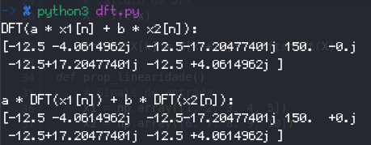
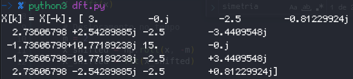

#### 1. A Transformada de Fourier no Tempo Discreto: Características e Propriedades

A Transformada de Fourier no Tempo Discreto (DTFT) permite analisar as características espectrais de sinais discretos no domínio da frequência. Dentre essas características, podemos citar a amplitude, fase, resposta em frequência e espectro de frequência de um sinal discreto.

![Sinal Discreto $x[n] = 0.8^{n}u[n]$](./sinaldiscreto.png)
![Diagrama de Módulo (a) e Fase (b) da DTFT do sinal discreto $x[n] = 0.8^{n}u[n]$](./espectograma.png)

Matematicamente, a DTFT é o somatório ponderado de exponenciais complexas, onde cada exponencial completa representa a fase e módulo para uma frequência específica.

A fórmula geral para a DTFT de um sinal discreto x[n] é:

$$ X(\Omega) = \sum_{n = -\infty}^{\infty} (x[n] \cdot e^{-j\Omega n})$$

Em outras palavras, a Transformada de Fourier no Tempo Discreto é a transformação linear de um sinal discreto para sua projeção em uma base de exponenciais complexas.  Assim como a Transformada de Fourier em Tempo Contínuo é um caso particular da Transformada de Laplace, a DTFT é um caso particular da Transformada Z, quando a RDC inclui o círculo unitário.

A Transformada de Fourier em Tempo Discreto pode ser dividida em três tipos:
* Série Discreta de Fourier (DFS): É a DTFT discretiza de forma exclusiva para sinais periódicos. Nesse caso particular, o somatório ponderado de exponenciais complexas ocorre apenas para o número de amostras dentro de um período $N_{0}$ do sinal discreto x[n] (0 a $N_{0}-1$). A saída representa o módulo e desvio de fase para cada harmônico (múltiplo inteiro $k$) da frequência $\omega$ do sinal de entrada. A fórmula a seguir representa a DFS:

$$X(k) = \sum_{n = 0}^{N-1}x[n]e^{-j2\pi\frac{kn}{N}}$$
  
* Transformada de Fourier de Tempo Discreto (DTFT): É uma transformação contínua que mapeia um sinal discreto x[n] para um espectro contínuo e periódico na frequência X($\Omega$). Nesse caso, a DTFT é uma função contínua de frequência (definida para qualquer valor de $\Omega$), representando a amplitude e fase para cada frequência contínua do sinal de entrada. A DTFT é definida para sinais que se estendem de -$\infty$ a $\infty$ no tempo discreto. A fórmula apresentada na introdução é a fórmula geral para a DTFT.

* Transformada de Fourier Discreta (DFT): Se trata de uma versão discretizada da DTFT para sinais não periódicos. A DFT é aplicada a sequências discretas de comprimento finito (o somatório ocorre de 0 a $N - 1$, onde N é o número de amostras na sequência) e produz um espectro de frequência discreto. Para o cálculo da DFT é utilizado o algoritmo FFT (Fast Fourier Transform), alvo de análise deste trabalho. A DFT é a transformada utilizada para a determinação de espectros de frequência de forma computacional, uma vez que computadores não conseguem lidar com um número infinito de valores. Note que se o número de amostras for suficientemente grande, pode-se aproximar com a precisão necessária a DTFT com a DFT. A fórmula da DFT é a mesma da DFS.

Algumas das propriedades da DFT:
1. Linearidade: A DFT de combinações lineares de sinais equivale a combinações lineares das DFTs dos sinais.
    
    Na figura, pode-se ver que a saída da DFT de uma combinação linear de sinais é a combinação linear das DFTs dos sinais.
2. Simetria conjugada complexa para sinais reais: Se o sinal for puramente real, as frequências negativas são complexos conjugados das frequências positivas.
    
    Na figura, pode-se ver que a DFT de um sinal real possui simetria conjugada complexa. O índice k = 0 é o valor 150-0j, os valores a direita são os índices 1 e 2, e a esquerda os índices -1 e -2, que são os complexos conjugados dos índices 1 e 2, respectivamente.

$$DFT(x[n-m]) = \sum_{n = 0}^{N-1}(x[n-m]\cdot e^{-j2\pi \frac{kn}{N}}\cdot e^{-j2\pi\frac{km}{N}})$$

Ou seja:
$$DFT(x[n-m]) = e^{-j2\pi\frac{km}{N}}\cdot\sum_{n = 0}^{N-1}(x[n-m]\cdot e^{(-j2\pi \frac{kn}{N})})$$

Em palavras, o deslocamento no tempo de um sinal no domínio do tempo corresponde a uma multiplicação por uma exponencial complexa (deslocamento de fase) no domínio da frequência.

As demais propriedades como reversão no tempo, deslocamento na frequência, convolução no tempo e na frequência não serão provadas neste trabalho, mas podem ser encontradas em [1].
#### 2. A DFT no Python

Dentre as implementações da DFT disponíveis na biblioteca scipy, destacam-se as funções fft e stft, que implementam a DFT e a STFT (Short-Time Fourier Transform), respectivamente.

* scipy.fft.fft: Calcula a DFT de um sinal discreto. A função fft retorna o espectro de frequência discreto e periódico de um sinal discreto. A função fft é uma implementação do algoritmo FFT (Fast Fourier Transform), que é um algoritmo eficiente para o cálculo da DFT. O algoritmo FFT é uma versão otimizada da DFT, que explora a simetria do sinal de entrada para reduzir o número de operações necessárias para o cálculo da DFT. A DFT possui complexidade O(N^2), enquanto o algoritmo FFT possui complexidade O(NlogN).

    $$X(k) = \sum_{n = 0}^{N-1}x[n]e^{-j2\pi\frac{kn}{N}} = \sum_{n = 0}^{N/2-1}x[2n]e^{-j2\pi\frac{k(2n)}{N}} + \sum_{n = 0}^{N/2-1}x[2n+1]e^{-j2\pi\frac{k(2n+1)}{N}}$$

    $$X(k) = \sum_{n = 0}^{N/2-1}x[2n]e^{-j2\pi\frac{2kn}{N}} + e^{-j2\pi\frac{k}{N}}\sum_{n = 0}^{N/2-1}x[2n+1]e^{-j2\pi\frac{2kn}{N}}$$

    $$X(k) = \sum_{n = 0}^{N/2-1}x[2n]e^{-j2\pi\frac{kn}{N/2}} + e^{-j2\pi\frac{k}{N}}\sum_{n = 0}^{N/2-1}x[2n+1]e^{-j2\pi\frac{kn}{N/2}}$$

    $$X(k) = X_{par}(k) + e^{-j2\pi\frac{k}{N}}X_{impar}(k)$$
* 
    Em palavras, o algoritmo FFT consiste em separar o sinal em duas metades iguais, uma contendo os índices pares e outra contendo os índices ímpares. Em seguida, é aplicada o algoritmo FFT novamente nas partes pares e ímpares. O algoritmo FFT é, portanto, recursivo, sendo que a condição de parada é quando o tamanho do sinal é 1. O algoritmo FFT possui complexidade O(NlogN), enquanto a DFT possui complexidade O(N^2) (para cada múltiplo k da frequência fundamental é necessário iterar N vezes o sinal). Após computar todas as FFTs recursivamente, a FFT do sinal é construída "de trás pra frente" unindo as partes pares com suas respectivas partes ímpares deslocadas em fase por $2\pi \frac{k}{N}$ rad.

    Em particular, a função fft do scipy.fft, bem como o algoritmo FFT, são extremamente aprimorados para tamanhos de dados múltiplos de 2. Caso o número de amostras N não seja múltiplo de 2, ocorre um zero-padding para que o tamanho do sinal seja múltiplo de 2. O zero-padding é o preenchimento do sinal com zeros para que o tamanho do sinal seja múltiplo de 2. O zero-padding não altera o espectro de frequência do sinal, apenas aumenta a resolução do espectro de frequência. O zero-padding é necessário para que o algoritmo FFT seja aplicado de forma eficiente, uma vez que o algoritmo FFT é baseado na divisão do sinal em partes iguais.

    A biblioteca scipy.fft possui outras funções para a determinação da DFT para dados de N dimensões usando o FFT e para caso de sinais puramente reais na entrada. Para sinais puramente reais, o algoritmo FFT não sofre alterações, apenas não são computados os valores de frequência negativa, uma vez que estes são simétricos aos valores de frequência positiva (propriedade de simetria conjugada). Já para as funções de N dimensões, o algoritmo FFT é aplicado para cada dimensão do sinal de entrada conforme a seguinte fórmula ilustra para 2 dimensões.

    $$X(k, l) = \sum_{i = 0}^{N_{i}-1}\sum_{j = 0}^{N_{j}-1}x[i, j]e^{-j2\pi(\frac{ki}{N_{i}}+\frac{lj}{N_{j}})}$$ 

    O algoritmo FFT também pode ser utilizado para realizar a convolução de sinais de forma eficiente por conta da propriedade de convolução no tempo (fftconvolve na biblioteca scipy.signal).

* scipy.signal.stft: Calcula a STFT de um sinal de entrada. A STFT trata-se da DFT calculada sobre uma janela deslizante de amostras de uma sequência (tamanho de n amostras por segundo, por padrão  256). Dessa forma, aplicando a STFT em um sinal é possível analisar as variações nas características espectrais no sinal ao longo do tempo.

    A STFT é calculada a partir da seguinte fórmula:
    $$STFT(t, f_{s}) = \sum_{n = 0}^{N-1}x[n]\cdot W(n-t) \cdot e^{-j\frac{2\pi nf_{s}}{N}}$$

    Onde $W(n-t)$ é a função janela que limita a contribuição do sinal x[n] para um intervalo t (tempo no qual a janela muda de posição "deslizando" sobre o sinal).

    Dentre as opções que a implementação da stft no scipy recebe, destacam-se a possibilidade da utilização de diferentes funções janela, além de permitir a utilização de janelas com sobreposição. A função janela padrão é a janela de Hamming com sobreposição de 50% entre janelas. Basicamente com essa janela as amostras com maior contribuição para o cálculo da STFT são as amostras centrais da janela (que, por conta do overlap, são as amostras na interseção entre duas janelas), enquanto as amostras nas bordas da janela possuem menor contribuição. A sobreposição de 50% entre janelas significa que a janela desliza de 50% do seu tamanho a cada iteração. Dessa forma, a cada iteração, 50% das amostras da janela anterior são utilizadas na próxima iteração.

Ambas as funções fft e stft possuem suas inversas que apenas utilizam a equação inversa de Fourier para a reconstrução do sinal de entrada.

$$x[n] = \frac{1}{N}\sum_{k = 0}^{N - 1} X(\Omega) \cdot e^{+j\Omega_{k} n}$$
Como a DFT (e consequentemente a STFT) de um sinal é uma representação discretizada da resposta em frequência do sinal x[n], então $\Omega_{k} = \frac{2\pi k}{N}$. Onde k são os índices de frequência (harmônicos) e N é o número de amostras do espectro X[$\Omega$]. 
Para a reconstrução do sinal a partir da STFT, a fórmula é a mesma, basta que seja feita a soma das contribuições de cada janela deslizante. 

#### 4. Bibliografia
1. Sinais e Sistemas Lineares, 2ª Edição, B. P. Lathi, LTC, 2007.
2. [Transformada Rápida de Fourier](https://pt.wikipedia.org/wiki/Transformada_rápida_de_Fourier)
3. [Documentação scipy.fft](https://docs.scipy.org/doc/scipy/reference/fft.html)
4. [Documentação scipy.signal](https://docs.scipy.org/doc/scipy/reference/signal.html)
5. [Documentação numpy.fft](https://numpy.org/doc/stable/reference/routines.fft.html)